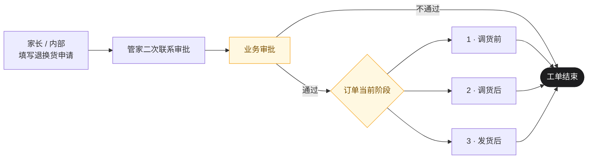
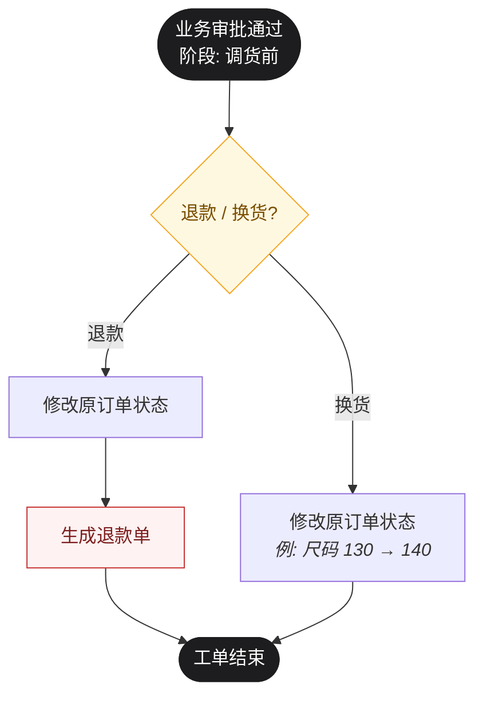
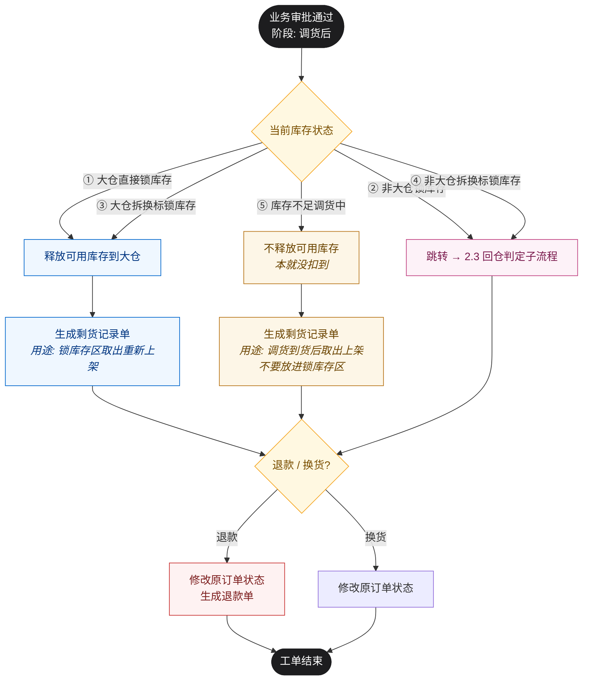
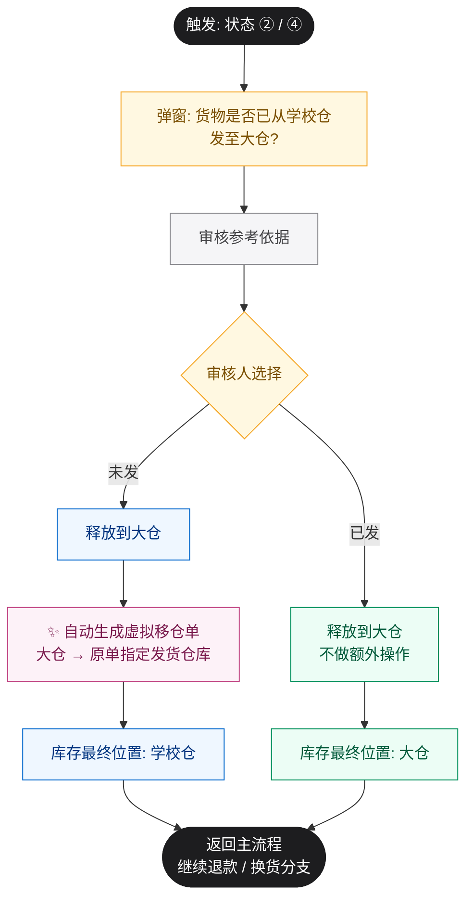
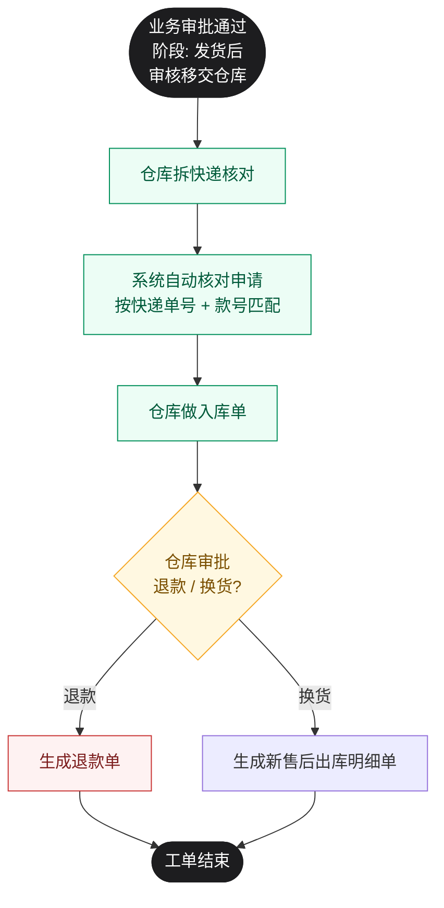

# 售后标准工作流程

---

## 整体流程

业务审批通过后，按订单当前阶段走以下三条路径之一。

---

## 1 · 调货前退换货

---

## 2 · 调货后退换货

调货后表示已经过快速库存判定，订单一定处于 5 种状态之一。5 种状态的差异不只是名字，**指定发货仓库 / 移仓明细 / 拆换标备注 / 入库明细** 这四个字段共同决定它属于哪类。

### 2.1 五种状态的扣货特征

| 编号 | 状态 | 指定发货仓库 | 移仓明细 | 拆换标备注 | 入库明细 |
|---|---|---|---|---|---|
| ① | 大仓直接锁库存 | 空 | — | — | — |
| ② | 非大仓锁库存 | 学校仓 | ✓ | — | — |
| ③ | 大仓拆换标锁库存 | 空 | — | ✓ | ✓ |
| ④ | 非大仓拆换标锁库存 | 学校仓 | ✓ | ✓ | — |
| ⑤ | 库存不足调货中 | — | — | — | — |

### 2.2 主流程

### 2.3 回仓判定子流程（针对 ② / ④）

**触发原因**：快速库存判定锁库存后，退换货时系统默认把库存释放到大仓。但 ② / ④ 的库存原本来自学校仓——若货物还没从学校仓发到大仓，统一释放到大仓会让学校仓账实不符。当前系统只能操作移仓单，无法直接指定释放仓库，因此需要人工判断 + 自动生成虚拟移仓单。

**审核参考依据**（弹窗展示给业务）：

| 信号 | 未发 | 已发 |
|---|---|---|
| 移仓单状态 | 待发出 | 已签收 |
| 大仓入库记录 | 无 | 有 |
| 学校仓当前库存 | > 0 | = 0 |

**虚拟移仓单字段**（未发时自动生成）：

| 字段 | 取值 |
|---|---|
| 移出仓库 | 大仓 |
| 移入仓库 | 原单「指定发货仓库」 |
| SKU / 数量 | 退换货明细 |
| 备注 | `退换货自动回库_单号_判断人_时间` |
| 状态 | 直接完成 |
| 标识 | 虚拟移仓 |

> 虚拟移仓单只调整账面库存，**不产生实际物流**。

---

## 3 · 发货后退换货

> 审批角色由 **业务 → 仓库**。必须实物收回并入库后才能审批通过。

---

## 关键规则

### 可用库存释放

| 阶段 / 状态 | 业务审核通过后释放? |
|---|---|
| 调货前 | — （本就没占用库存） |
| ① 大仓直接锁库存 | ✅ 释放到大仓 |
| ② 非大仓锁库存 | ✅ 经回仓判定决定（未发→学校仓 / 已发→大仓）|
| ③ 大仓拆换标锁库存 | ✅ 释放到大仓 |
| ④ 非大仓拆换标锁库存 | ✅ 经回仓判定决定（未发→学校仓 / 已发→大仓） |
| ⑤ 库存不足调货中 | ❌ 不释放（本就没扣到）|
| 发货后 | ❌ 不释放，**库存恢复依赖仓库入库单** |

### 剩货记录单

| 状态 | 是否生成 | 用途 |
|---|---|---|
| ① 大仓直接锁库存 | ✅ | 告诉仓库：锁库存区的货发生退换，取出重新上架 |
| ③ 大仓拆换标锁库存 | ✅ | 同 ① |
| ⑤ 库存不足调货中 | ✅ | 告诉仓库：调货批次到货后把对应商品取出上架，不要默认放进锁库存区 |
| ② 非大仓锁库存 | ❌ | 由业务通过回仓判定单独处理 |
| ④ 非大仓拆换标锁库存 | ❌ | 由业务通过回仓判定单独处理 |
| 调货前 / 发货后 | ❌ | — |

### 单据生成时点

| 单据 | 生成时点 |
|---|---|
| 退款单（调货前 / 调货后）| 业务审核通过时 |
| 退款单（发货后）| 仓库审批通过时 |
| 新售后出库明细单 | 仅发货后换货生成，仓库审批通过时 |
| 剩货记录单 | 调货后业务审核通过时（详见上表）|
| 虚拟移仓单 | 调货后 ② / ④ 状态且回仓判定为「未发」时自动生成 |

### 几个容易混的点

- **管家二次联系审批是强制的**，无论家长还是内部填写，都要走。
- **调货前 / 调货后的换货不生成新出库单**，只修改原订单状态（如尺码从 130 改为 140）。
- **发货后退换货的"业务审批"由仓库承担**，原因是必须先确认实物入库。
- **业务审核通过不会释放发货后的库存**——发货后库存恢复完全靠仓库做入库单。

---

*文档版本：v2 · 2026-05*
